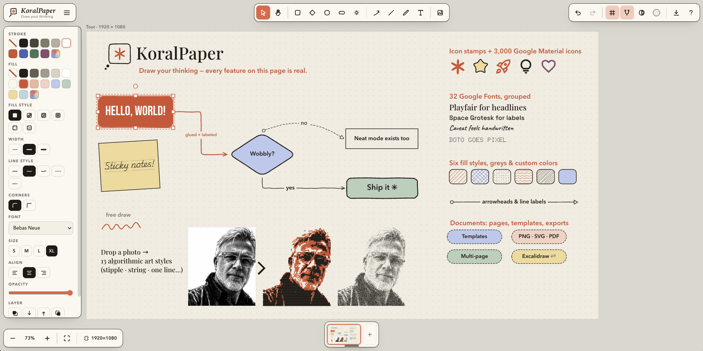

# KoralPaper — *Draw your thinking* (v3.49.0)

A local, offline vector diagram & sketch studio: warm cream paper, faint
grid, wobbly hand-drawn shapes, sticky notes, label chips, curved and elbow
arrows, serif headlines — and the coral KoralPaper asterisk. Built for
thinking out loud: diagrams that look sketched by a confident hand, not
generated by a tool.

**Zero dependencies. No server, no build, no npm, no database, no account.**
One HTML file, one stylesheet, three JavaScript files. Your work never leaves
your machine. During drags and pans only the moving elements are redrawn
(everything else is served from an offscreen bitmap), so even documents with
hundreds of elements stay perfectly fluid.

## Start drawing (nothing to install)

**→ [koralpaper on the web](https://karagos.github.io/koralpaper/)** — open
the link and draw. Works on Mac, Windows, Linux, ChromeOS **and iPad**, in
any modern browser.

Even better, **install it as an app**: the page is a PWA, so after the first
visit it works fully offline.

- **Mac / Windows (Chrome or Edge):** click the install icon in the address
  bar (or menu → "Install KoralPaper").
- **iPad / iPhone (Safari):** Share button → **Add to Home Screen**.
- Your work autosaves in the browser and stays on your device — the "app"
  never talks to a server.

## Or run it from a folder

Prefer a local copy? Grab the newest ZIP from the
[**Releases page**](https://github.com/karagos/koralpaper/releases)
(or clone the repo), unzip, and double-click **`index.html`** — it runs
straight from the file, offline, in any modern browser. To update later,
download the new ZIP and replace the folder; your work lives in the
browser's storage, not in the folder.

## Add Claude (optional, one minute)

To let Claude draw on your paper: install the free
[Claude Desktop](https://claude.ai/download) app (Mac or Windows), then
double-click **`koralpaper.mcpb`** from the `mcp/` folder (also attached to
each Release) and confirm the install inside Claude Desktop. Full details in
the app under **? → Claude**.

## First run

A welcome card offers the 60-second tour or a blank page (the tour stays
available via ☰ → "Load the KoralPaper tour", and the card replays from
? → Settings). A blank canvas shows gentle starter hints until your first
element lands. Press **?** inside the app for shortcuts, the Claude setup,
and Settings.

## What it does

- **Tools:** select (V), hand/pan (H), sticky rectangle (R), diamond (D),
  ellipse (O), label chip (C), icon stamps (S), arrow (A), line (L),
  free draw (P), text (T)
- **Icon library (S):** the 6-spoke KoralPaper asterisk, the three brand
  marks (asterisk on paper, paper & stroke, paper thought), spiral, cloud,
  star, heart, lightning bolt, speech bubble, exclamation, question mark,
  checkmark — all hand-drawn; click the ✳ toolbar button to pick.
  **Plus Google Material icons**: search 3,000 Material Symbols right in
  the icon menu (pinned ★, recently-used, and the popular nine lead the
  grid — right-click any icon to pin it) and stamp them as scalable
  vectors. Fetched from Google once per icon, cached, and embedded in
  your document — saved sketches stay fully offline
- **Text everywhere:** double-click any shape to type inside it (text wraps and
  the shape grows); standalone text elements; **arrows and lines take labels**
  that ride their midpoint and follow every move and bend
- **Typography controls:** per-element **line spacing** (×0.5–2.5),
  **paragraph spacing** (extra space at every Enter — soft-wrapped
  lines inside shapes keep the line spacing), **letter spacing**
  (−7 to +15px tracking), and **vertical alignment** inside shapes
  (top / middle / bottom) — all live in the style panel and all carried
  by copy/paste-style and SVG/PNG/PDF exports
- **Excalidraw interop:** ☰ → Export page to Excalidraw; opening a
  .excalidraw file imports it onto a new page (bound labels, groups, images
  and colors survive the round trip)
- **Fonts:** 3 built-in stacks (serif/sans/hand) plus a grouped Google
  Fonts picker with 32 families — Sans & display (Inter, Montserrat,
  Roboto Condensed, Bebas Neue, Fjalla One, Oswald, Imbue, DM Sans, Space
  Grotesk), Serif (Playfair Display, PT Serif, Lora), Mono (JetBrains
  Mono, IBM Plex Mono, Share Tech Mono), Hand & script (Caveat, Patrick
  Hand, Kalam, Architects Daughter, Shadows Into Light, Lobster Two,
  Playwrite NZ Guides, Unkempt, Kaushan Script), and Pixel & dot
  (Bitcount ×3, Tiny5, Doto) — need internet once; system fallbacks
  offline
- **Design with Claude (MCP):** install the one-click **koralpaper.mcpb**
  extension (in the `mcp/` folder) into the free
  [Claude Desktop](https://claude.ai/download) app, keep KoralPaper open,
  and just talk: *"draw a customer onboarding flowchart on a 1920×1080
  board"* — Claude draws it live on your paper as ordinary hand-drawn
  elements you can edit, restyle and undo (one ⌘Z per Claude step).
  Claude can also **read the page** and **look at a rendered picture of
  it**, so *"tidy this layout"* or *"make the third box green"* work on
  whatever is on the paper, including what you drew by hand. The ✳ in the
  top bar glows while the link is alive; the **Claude tab in the ? panel**
  has the one-minute setup. No API key, no extra billing, nothing leaves
  your machine except your conversation with Claude. Without Claude
  Desktop there is a fallback: the same tab copies a **design prompt** you
  can paste into any Claude — the .json it answers with opens straight in
  the app
- **Charts & tables (B):** paste numbers straight from a spreadsheet and get
  hand-drawn bars (vertical or sideways, multi-series, negatives welcome),
  line charts, spider charts, pies, donuts, or an elegant striped table — with title, axis
  labels, legend, value labels, a movable legend, and a live preview, in two looks:
  hand-drawn Sketchy or crisp professional Clean. Everything lands as normal sketchy
  elements in one group: recolor any bar or slice with the usual controls,
  and right-click the chart to **edit its data** and rebuild it in place.
- **Mind-map folding:** right-click a shape → "Mark as mind-map root"
  and branches become foldable — **−** badges fold, coral **+N** badges
  unfold and show how many nodes are hidden. Cross-links behave
  correctly (a shared child stays while any open path reaches it),
  folds are undoable, save with the document, respect exports, and can
  be toggled live **during a presentation** by tapping the badge —
  reveal your structure branch by branch while you talk
- **Tab-to-create flows:** select a shape and press **Tab** — a connected
  twin appears to the right (⇧Tab: below), same style, glued arrow, text
  editor already open. It works mid-typing too, so "type, Tab, type, Tab"
  builds a flowchart in seconds. **Tidy** (the Arrange button or
  right-click → "Tidy the flow") then arranges everything connected by
  glued arrows into neat left-to-right columns
- **Glued arrows:** draw an arrow from one shape to another — it binds to both
  borders and follows when shapes move, resize, or rotate. Aim for the four
  side dots (N/E/S/W) to pin the arrow to a specific side; drop in the middle
  for smart auto-aiming. Select an arrow and **drag its middle handle** to
  bend the curve (drag back to the line to straighten). The Arrow-bend row
  also offers **elbow arrows** — right-angle routes with rounded corners
  that exit perpendicular to the glued side, **route around other shapes
  automatically**, and show a **drag handle on every segment** for full
  manual control (right-click → "Re-route elbow" to go back to auto)
- **Grid:** three states — lines / dots / off — plus an adjustable grid size
  (10–60px): click the grid button for the popover; G cycles states; snapping
  follows the chosen size
- **Paper color:** the round swatch in the top-right opens a popover with
  8 preset papers (white, light gray, light blue, soft green, soft yellow,
  soft mauve, warm linen + the theme cream), a color wheel, and a hex
  field; exports use the chosen paper too. The theme swatch (or ☰ menu →
  "Reset paper color") restores the default
- **Canvas sizes / artboards:** the artboard button (bottom-left — its
  label shows the active preset's dimensions, or ∞) offers presets —
  IG Story/Reel, IG post & portrait, LinkedIn, X, YouTube; desktop & iPhone
  wallpapers; 1:1, 16:9, 9:16, 4:3, 3:2 ratios — or unlimited canvas.
  With an artboard active, PNG/SVG exports are exactly that pixel size and
  include the grid (lines or dots) unless you export transparent
- **Grouping:** ⌘G / ⇧⌘G or the Group/Ungroup buttons in the panel; clicking
  any member selects the whole group
- **Arrange:** align left/center/right/top/middle/bottom, distribute
  horizontally/vertically, and match width/height to the first-selected
  shape (2+ shapes; groups move as one; arrows re-glue automatically and
  are excluded)
- **Copy/paste style:** ⌥⌘C / ⌥⌘V (or right-click) carries stroke, fill,
  and text styling from one element onto many
- **Right-click menu:** edit text, duplicate, copy, delete, group/ungroup,
  and layer order on any element; paste/select-all/zoom-fit on empty canvas
- **Templates:** ☰ → Templates… — built-in page sets (LinkedIn carousel
  with header/footer/title/photo/CTA slides on a 1080×1350 artboard,
  Black carousel — a crisp black + electric-yellow design set that also
  recolors the paper, Flowchart kit, Comparison/Versus, Quote card).
  Save **this page or the whole multi-page document** as your own template
  — canvas size and paper color included — then **rename (✎), update (↻),
  or delete (✕)** any template, built-ins included: replace a built-in
  with your own design, remove it from the list, and "Restore built-ins"
  brings the originals back anytime. Applied templates arrive as fresh,
  fully editable pages
- **Multi-page documents:** page strip at the bottom — click to switch,
  **drag a thumbnail to reorder pages** (a coral mark shows where it will
  land), + to add, right-click a tab to rename/duplicate/move/delete.
  Undo spans pages
- **Presentation mode + laser pen:** ⇧⌘P (or ☰ → Present) hides every
  control, fits the page (or artboard) to the screen and goes fullscreen.
  Arrow keys, space or a click turn the pages; **dragging draws a glowing
  coral laser stroke whose tail evaporates in a second** — point at things
  live without marking the document. A minimal page bar wakes on mouse
  move; Esc ends the show and puts everything back exactly as it was
- **Draw-on replay + animated export:** ☰ → "Replay the drawing" plays
  the current page back as if a hand were sketching it — freehand strokes
  reveal point by point, arrows sweep out of their start, shapes and text
  ink in one after another (capped at ~20 seconds). "Export replay as
  video (.webm)" records the same animation to a video file, perfect for
  a LinkedIn post of your diagram drawing itself. Any click or key stops
  the show
- **PDF export:** ☰ or ⬇ → Export PDF. Multi-page documents open a page
  picker; with an artboard every page exports at the exact preset size with
  the grid included. Zero dependencies — works fully offline
- **Carousel export:** ☰ or ⬇ → "Export all pages as PNGs (.zip)" renders
  every page as a numbered PNG (exact artboard pixels when one is set) and
  packs them into a single .zip — the whole LinkedIn/Instagram carousel in
  one click. The ZIP is written by hand in ~50 lines; still zero
  dependencies
- **Share as a web page:** ☰ or ⬇ → "Share as web page (.html)" writes
  one self-contained HTML file — every page as an inline vector SVG plus
  a tiny dark-themed viewer with page navigation and keyboard arrows.
  Send it to anyone: it opens in any browser with no app, no server, no
  account, works offline, and images ride along inside the file
- **Copy as PNG / SVG:** ⇧⌘C (or the menus) puts the selection — or the
  whole page when nothing is selected — on the clipboard as a real PNG
  image, ready to paste into Slack, Notion, Keynote or a chat. "Copy as
  SVG" copies vector markup that pastes straight into Figma or a code
  editor
- **Your gallery:** a toolbar library for reusable SVG logos (pure vector,
  crisp at any zoom, vector in exports) and transparent PNG marks — click
  to place, right-click to remove, persisted in the browser
- **Frames:** any image can wear a hand-drawn border (Frame → On) that
  follows the Outline color, Thickness and Line style — and survives
  every art style, so pale photos hold their ground on the page
- **Images:** drag & drop or paste PNG/JPEG (toolbar 🖼 button, `I`, or
  ☰ → Import image); they act like any element — resize, rotate, glue
  arrows to them. **Crop** from the panel or right-click menu: drag across
  the region to keep; Uncrop restores the full image; crops compose with
  Artify in either order
- **Artify (algorithmic art):** select an image and choose an Art style —
  Dots, Lines, Stipple, Hatch, Cubist (colored facets), Cubist mono
  (facets in your stroke color), Flow (ink strokes that follow the photo's
  contours), Scribble (a restless pen builds tone by looping densely in the
  darks), One line (a single continuous line connecting the photo's
  salient contours, Edge-Drawing based), String (thread art around pins),
  Type (typewriter glyph portrait), or Duotone (two-ink poster, stroke +
  fill colors) — at three detail levels. Seeded and non-destructive (flip back
  to Photo anytime); SVG exports of artified images are pure vector
- **Photo adjustments:** Brightness / Contrast / Gamma / Sharpen sliders on
  every image — they shape both the photo and the art styles, so you can
  tune the source until the halftone/stipple/lines pop
- **Tooltips everywhere:** hover any button — tool, toolbar toggle, style
  control, zoom bar — and a fast, readable tooltip names it and shows its
  keyboard shortcut as a key chip; move along a row and the next tip
  appears instantly
- **Touch & iPad:** pinch to zoom, two-finger pan (a second finger safely
  cancels whatever the first finger started), and selection handles grow
  their hit areas under a finger. Works with Apple Pencil too — it draws
  like a mouse
- **Snapping:** grid snap (G toggles the grid) + smart alignment guides against
  other elements' edges and centers (⇧G toggles)
- **Selection:** click, shift-click, marquee, ⌘A, move, 8-handle resize,
  rotate handle, arrow-key nudge, ⌘G group / ⇧⌘G ungroup
- **Editing:** undo/redo (⌘Z / ⇧⌘Z) with intention-sized steps — a run of
  arrow-key nudges or slider wiggles undoes as one — copy/paste/cut, ⌘D
  duplicate, ⌥-drag duplicate, layer order (front/back/forward/backward),
  opacity
- **Styling:** Anthropic palette (ink, coral, periwinkle, sage, terracotta,
  butter…) **plus a black→greys→white neutral ramp** opening both stroke and fill,
  an **independent text color** (Auto follows the stroke and flips to light
  on dark fills; or pick any palette/custom color for the text alone), a
  **custom color picker** (rainbow swatch) with a hex field, a **no-stroke
  option** (fill-only shapes), **six fill styles** (solid, hatched, dense
  lines, cross-hatch, dots, waves — they work on icons too), 3 stroke
  widths, neat/sketchy/scribbly plus **dotted and dashed**
  line styles, round/sharp corners, arrow bend, and per-end arrowhead
  styles (arrow / hollow triangle / circle ring / none)
- **Themes:** light (cream) and dark (ink) paper — palette colors are stored
  as tokens and re-resolve per theme; custom hex colors stay fixed
- **Settings panel:** the ? button opens a Help / Settings side panel —
  Settings holds sliders for the three **line-width presets**, the four
  **S/M/L/XL text sizes**, and the **text spacing defaults** (lines,
  paragraph, letters — used by new texts and the Reset-spacing button),
  with per-section resets and **settings export/import** (a .json carrying
  every preset plus pinned icons, reloadable anytime or on another machine),
  applied live and persisted in the browser
- **Files:** New document (⌥⌘N, with a save-first warning — undoable),
  Save/Open `.json` sketches — Save asks for a file name and remembers it,
  Open replaces the whole document and adopts the file's name — export
  PNG (2×) or **SVG** — each with background or transparent — autosave
  to localStorage
- Press **?** in the app for shortcuts, tips, and Settings. The ☰ menu
  holds the document (New/Open/Save/Import/Templates) and the show
  (Present/Replay/Tour); the ⬇ button (top right) is the export menu,
  grouped into "This page" and "Whole document", with one **Transparent
  background** toggle that drives PNG and SVG exports.

## Files

| File | Role |
|------|------|
| `index.html` | UI shell (toolbar, style panel, menus, dialogs) |
| `css/style.css` | Cream "island" UI theme, light+dark |
| `js/core.js` | Engine: element model, geometry, seeded hand-drawn renderer, arrow routing, exports |
| `js/app.js` | Interactions: selection, snapping, history, text editing, templates, autosave |
| `js/material-icons.js` | Generated catalog of Google Material icon names + search tags |
| `mcp/` | Claude Desktop extension: `koralpaper.mcpb` (one-click install) + the dependency-free bridge |
| `examples/` | Ready-to-open documents (the KoralPaper tour) |
| `docs/` | README assets |

## License & credits

[MIT](LICENSE) — free to use, modify, and share.

**KoralPaper is a creation by Stefanos Karagos, CAIO Group —
[wearecaio.com](https://wearecaio.com).**
© 2026 Stefanos Karagos. Version history lives in
[CHANGELOG.md](CHANGELOG.md); the running version shows at the bottom of
the ☰ menu and is written into every saved .json.

Built with Claude in 2026. Safe to edit freely — no native modules, no data files.
